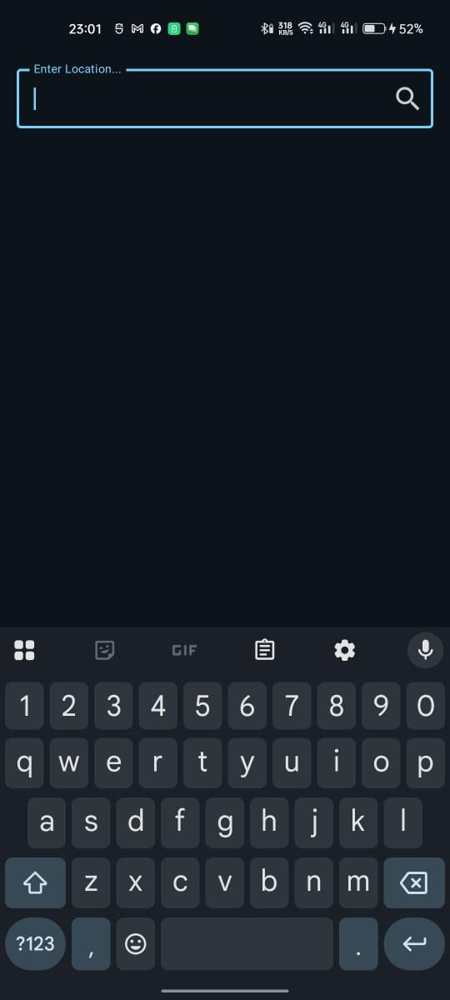
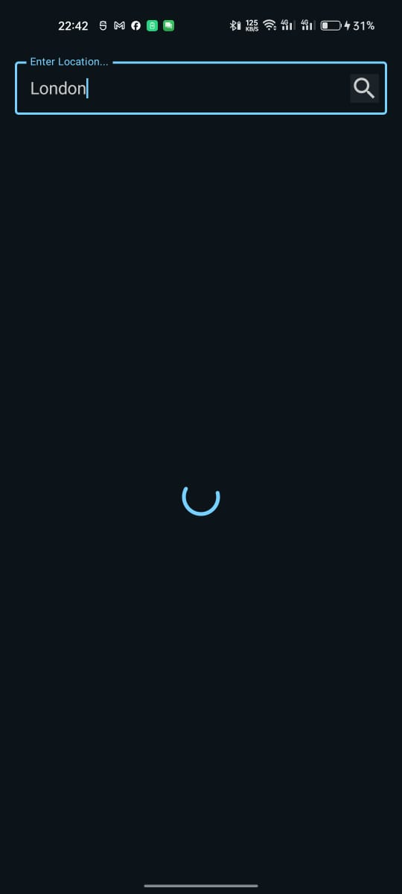
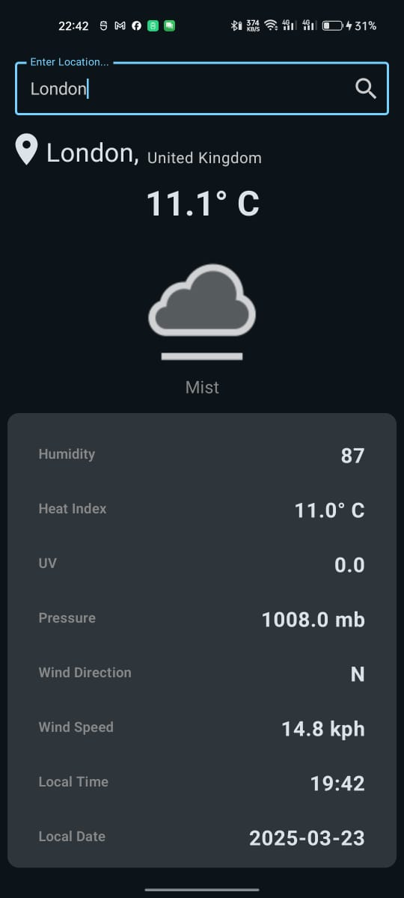
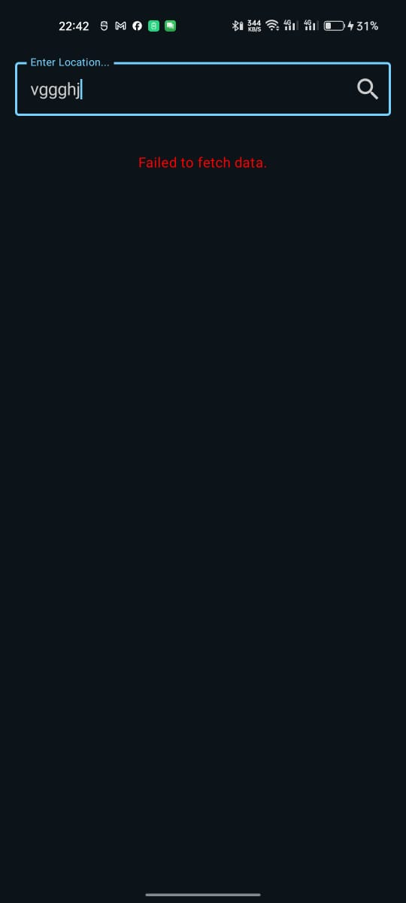

# Weather App

A simple Android app that allows users to enter a location in a text field and fetches the current weather conditions using WeatherAPI.com.

## Features

- Enter a location to search for current weather conditions.
- Fetches weather data from **WeatherAPI.com**.
- Displays real-time weather details (temperature, humidity, wind speed, etc.).
- Uses **Jetpack Compose** for UI.
- Supports smooth image loading with **Coil**.
- Handles API responses gracefully with error handling.

## Technologies Used

- Kotlin for Android development.
- Jetpack Compose for UI.
- Coil for loading images.
- Retrofit for API calls.

## Screenshots

1. ** Enter Location**
    

2. **Loading Location Current Weather**
    ]

3. **Display Current Weather**
     ]

4. **Error Handling**
     ]

